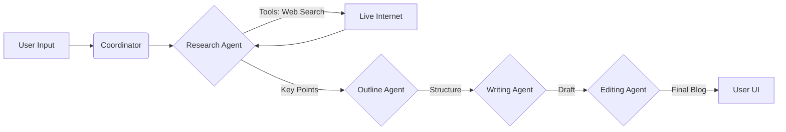

# 🖋️ LekhAI
### Your Autonomous, AI-Powered Editorial Team


**LekhAI** (derived from the Sanskrit word *Lekh* meaning "writing") is an advanced multi-agent system that orchestrates a team of AI personas to create high-quality, technically accurate blog posts.

Unlike standard "text generators," LekhAI doesn't just guess. It **researches the live web**, plans a **strategic outline**, drafts with **context**, and **polishes** the final output—mimicking a real-world editorial newsroom.

## 🚀 Key Features

* **🤖 Multi-Agent Architecture:** Four specialized agents (Researcher, Strategist, Writer, Editor) working in a coordinated sequence.
* **🌐 Live Web Access:** The Research Agent uses **DuckDuckGo Search** to fetch real-time data, sources, and recent developments (no API key required).
* **⚡ Real-Time Streaming:** Uses Server-Sent Events (SSE) to stream progress and content to the UI instantly.
* **🧠 Gemini Powered:** Built on Google's **Gemini 2.5 Flash** (or 1.5 Flash) for high speed and low cost.
* **🎨 Modern UI:** A clean, responsive interface built with **Tailwind CSS** and **Glassmorphism** design.
* **💾 Session History:** Tracks and saves your past generations for easy retrieval.
* **📝 Markdown Support:** Full rendering of headings, lists, and code blocks.


## 🛠️ System Architecture

LekhAI uses a **Sequential Coordinator** pattern. The main application acts as the orchestrator, passing the state between agents.



## The Agent Roster
- 🔍 Researcher: Scours the web for 5-10 key facts and sources.
- 📋 Strategist: Converts raw facts into a logical, SEO-friendly outline.
- ✍️ Writer: Expands the outline into a full draft with code snippets and examples.
- ✨ Editor: Fixes grammar, adjusts tone, and ensures professional formatting.


## 📦 Installation
Prerequisites

- Python 3.10 or higher
- Google Gemini API Key

1. Clone the Repository
```bash
git clone https://github.com/Vrajesh-Sharma/Blog-Agent.git
cd LekhAI
```
2. Create a Virtual Environment
```bash
python -m venv venv
# Windows
venv\Scripts\activate
# Mac/Linux
source venv/bin/activate
```
3. Install Dependencies
```bash
pip install -r requirements.txt
```
4. Configure Environment
Create a .env file in the root directory:

```bash
# Code snippet
GOOGLE_API_KEY=your_gemini_api_key_here
GEMINI_MODEL=gemini-2.5-flash  # Recommended for speed
```
5. Run the Application
```bash
python app.py
Access the application at: http://127.0.0.1:5000
```

## 📂 Project Structure

```bash
LekhAI/
├── agents/                 # The brains of the operation
│   ├── agent_base.py       # Base class handling Gemini connections
│   ├── research_agent.py   # Web searching logic
│   ├── outline_agent.py    # Structuring logic
│   ├── writing_agent.py    # Drafting logic
│   └── editing_agent.py    # Polishing logic
├── tools/                  # Capabilities given to agents
│   ├── google_search_tool.py # DuckDuckGo integration
│   └── create_outline_tool.py
├── templates/              # Frontend UI
│   ├── base.html           # Layout and Tailwind setup
│   ├── index.html          # Landing page
│   ├── generate.html       # Streaming generation interface
│   └── history.html        # Past blogs view
├── services/               # State management
│   ├── session_service.py
│   └── memory_service.py
├── app.py                  # Main Flask application & Coordinator
├── requirements.txt        # Python dependencies
└── .env                    # API Keys (Hidden)
```

## 🔧 Configuration & Customization
### Changing Models
You can switch between Gemini versions in your .env file.

- Speed/Free Tier: gemini-2.5-flash or gemini-1.5-flash

- High Quality: gemini-1.5-pro (Note: Lower rate limits may apply)

### Modifying Agent Prompts
To change how an agent behaves (e.g., making the Writer more humorous), edit the `system_instruction` in the respective file under `agents/`.

Example (`agents/writing_agent.py`):

```bash
system_instruction=(
    "You are a witty technical writer. Use analogies and humor..."
)
```

## ❓ Troubleshooting
### Error: 429 Resource Exhausted
- Cause: You are hitting the Gemini Free Tier rate limits (approx 15 requests/min).
- Fix: The system has built-in time.sleep(5) delays in app.py. If you still see this, increase the sleep time to 10 seconds.

### Error: "Could not convert part.function_call"
- Cause: The model tried to use a tool but the code didn't handle the callback.
- Fix: Ensure agents/agent_base.py has enable_automatic_function_calling=True inside the chat session initiation.

### Search Results are Empty
- Cause: DuckDuckGo rate limiting.
- Fix: The tool catches this error gracefully. Try again in a few minutes or ensure your IP isn't blocked.

## 🤝 Contributing
Contributions are welcome! Please feel free to submit a Pull Request.
1. Fork the project
2. Create your Feature Branch (git checkout -b feature/AmazingFeature)
3. Commit your changes (git commit -m 'Add some AmazingFeature')
4. Push to the Branch (git push origin feature/AmazingFeature)
5. Open a Pull Request

## 👨‍💻 Author
### *Vrajesh Sharma*

- [LinkedIn](https://www.linkedin.com/in/vrajesharma-7-dsa/)
- [Portfolio](https://vrajesharma.vercel.app)
- [GitHub](https://github.com/Vrajesh-Sharma)

<div align="center"> <sub>Built with ❤️</sub> </div>